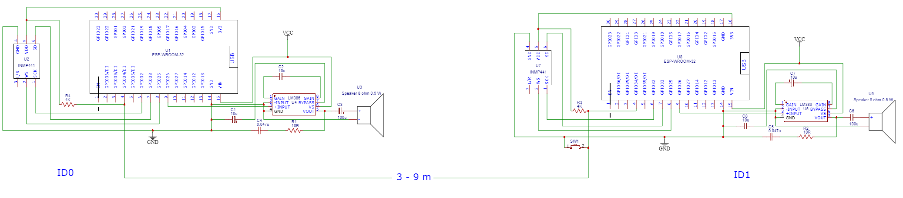

# IoT_for_Masjids
This is a test structure for the sound level control for mosques.
## The structure consists of:
### 3 nodes, 2 of them are identical and connected as follows:

On each one of them [the code](https://github.com/DrNaeemOdat/IoT_for_Masjids/blob/main/IoT_Node/IoT_Node.ino) is installed by comment out the approprite lines in the file.

The third node is the monitor node which is only an ESP32 dev board. The code installed on it is [monitor node](https://github.com/DrNaeemOdat/IoT_for_Masjids/monitor_node.ino)

### Mosquitto broker:

This is installed on a windows machine connected to the same network.
